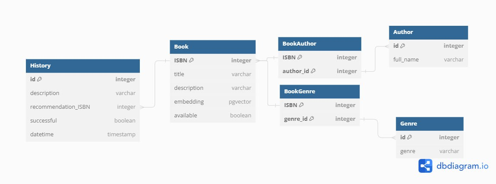

# Database Schema

## Overview
Our system uses a PostgreSQL database with the `pgvector` extension to store the book data and the embeddings.

## Tables

Overall, we have the following tables in our database:

- Book - stores information about the books.
- Author - stores information about the authors.
- Genre - stores information about the genres.
- BookAuthor - stores the many-to-many relationship between books and authors.
- BookGenre - stores the many-to-many relationship between books and genres.
- History - stores the history of recommendations made to users.